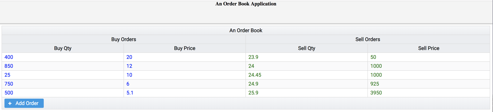
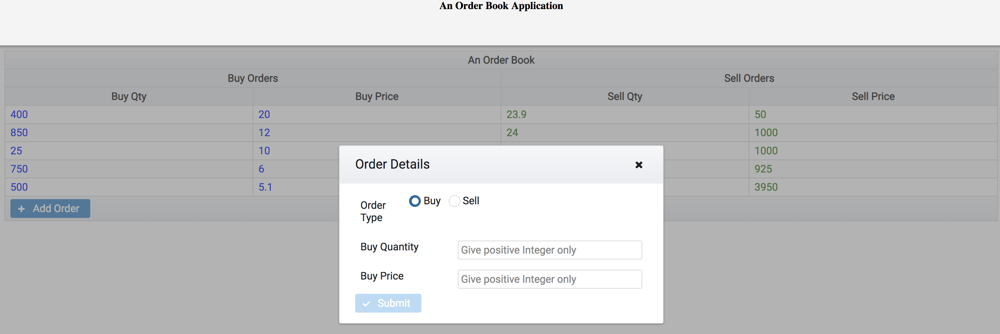
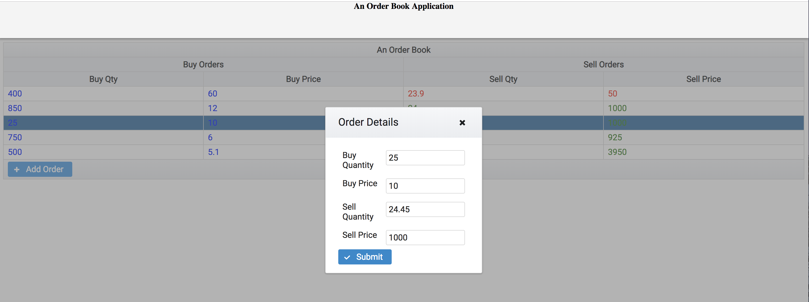

# Angular OrderBook App

An order book is the list of orders that a trading venue uses to record the interest of buyers and sellers in a particular financial instrument. An
order will be one of either a buy or sell order and contain a price and a volume.

## Usecases:

**Step1:** Format the orderbook into a table showing the list of bids and list of offers.

**Step2:** Add new order which updates the orderbook

**Step3:** Display order details when you select particular order

## Assumptions:
1. Let's reformat the data structure as per dataGrid
2. Mock the data in order-book.json file instead endpoint **/market/orderbook** Since the backend is not available

## Development server
Run `ng serve` for a dev server. Navigate to `http://localhost:4200/`. The app will automatically reload if you change any of the source files.

## Running unit tests

Run `ng test` to execute the unit tests via [Karma](https://karma-runner.github.io).

## Running end-to-end tests

Run `ng e2e` to execute the end-to-end tests via [Protractor](http://www.protractortest.org/).
Before running the tests make sure you are serving the app via `ng serve`.

